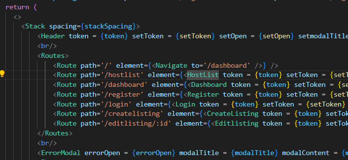
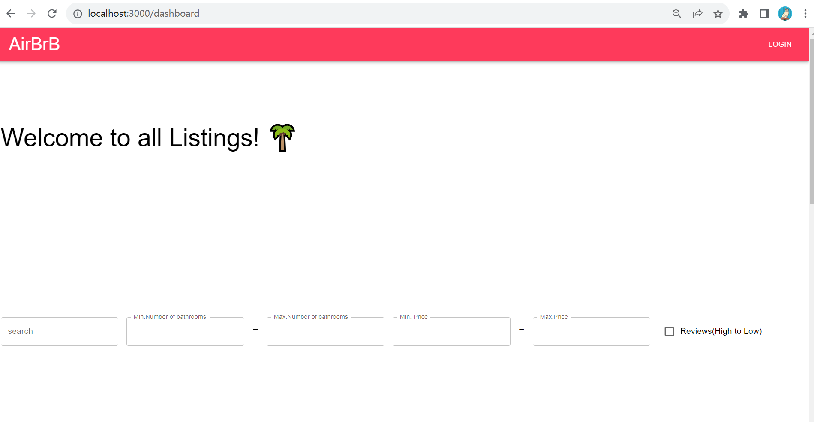
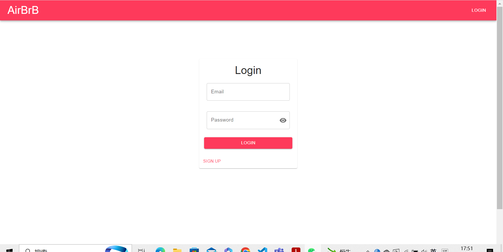
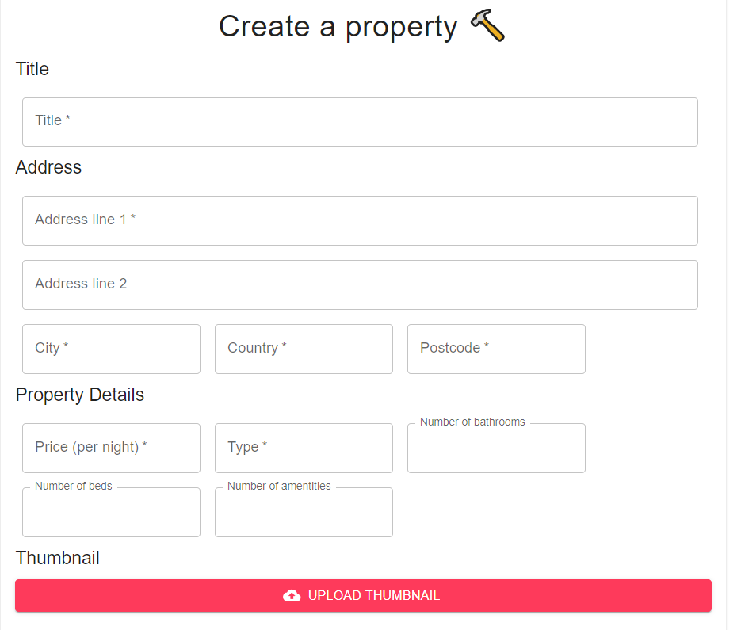
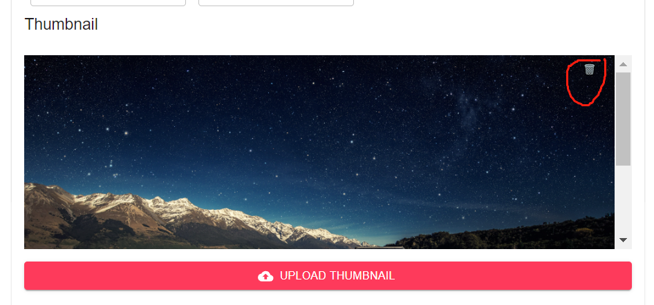
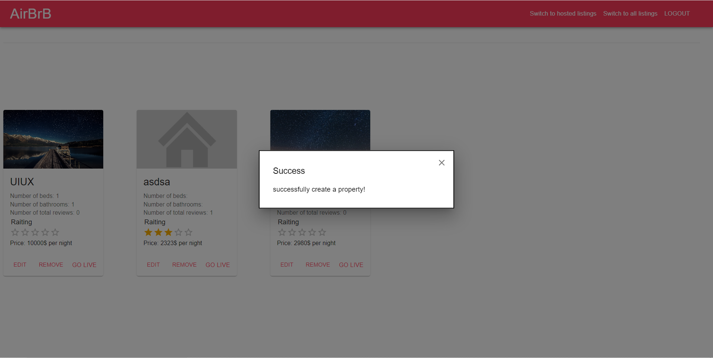
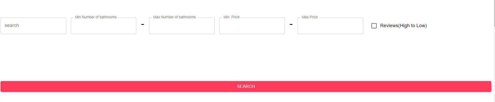

# 1. Landing page is prompted to all listing pages. 
## a. We create a route for landing page localhost:3000. Easy to navigate
When user searches for localhost:3000/, they will be navigated to the all listing page. 
This UX design aligns with the design principle of logical and clean structure, which shows how the pages are structured so that users are easier to navigate to the dashboard of our Airbrb website, which improves the UI experience. 

## b. Flexibility to use
In the login page, the login card has a "Sign up" button for the new users to create their accounts. Similarly, the register card also has a "login" button to go back to login. 
This design adds to the flexibility of use in login execution, which also increases the utility of usability goal and enhances users' satisfactory experience.

## c. Colour contrast
The Register and Login buttons are highlighted by the color contrast, which navigates the users to finish the login/registration process. This design aligns with the design principle of affordance and visibility of system, which adds to the learnability of the usability goal and leads to an enjoyable user experience. 

# 2. Create Page. 
## a. Clear instructions
The create listing pages contains a card that gives clear definitions about what infomation users need to give to successfull create a new listing. 
This design adds on the affordance of the pages, which increases users' learnability and effectiveness to achive the goal. 

## b. Flexibility to delete the uploaded images (Error prevention)
There exists a bin icon on each uploaded image that allows users to delete the images. This design matches the heuristics of error provention, which users could accidentally upload wrong images and they would like to delete them. The deleteion button increases the utility of usability goal and leads to a enjoyable user experience. 

# 3 Message Modal
## a. Responsive
Once users click the submit button, a new listing is successfully created. There will be message modal poping out informing users the success. This design is responsive to users' actions which constantly provide users with feedback so that they know the effects of their actions. Hence, this design aligns with the design principle of feedback, which achieves usability goal of effectiveness which results in a hepeful user experience. 

# 4. Headers
## a. User freedom and control
The website headers always exist on each page. The "switch to hosted listing" and "swicth to all listing" buttons exist on every sreen of the website, so users can easily navigate to the all listing or hosted listing page. This design aligns with the heuristics principle of user freedom and control, where users can have the control to swicth to any page easily by clicking a single button. 

# 5 Search filters. 
## a. Flexibility and efficiency of use. 
The all listing page has a filter function where user input multiple parameters to quickly search for the properties that suit them. This design aligns with the heuristics princile of flexibility and efficiency of use, which adds to the usability of efficiency and ultility, motivating to a enjoyable and hepeful user experience. 
